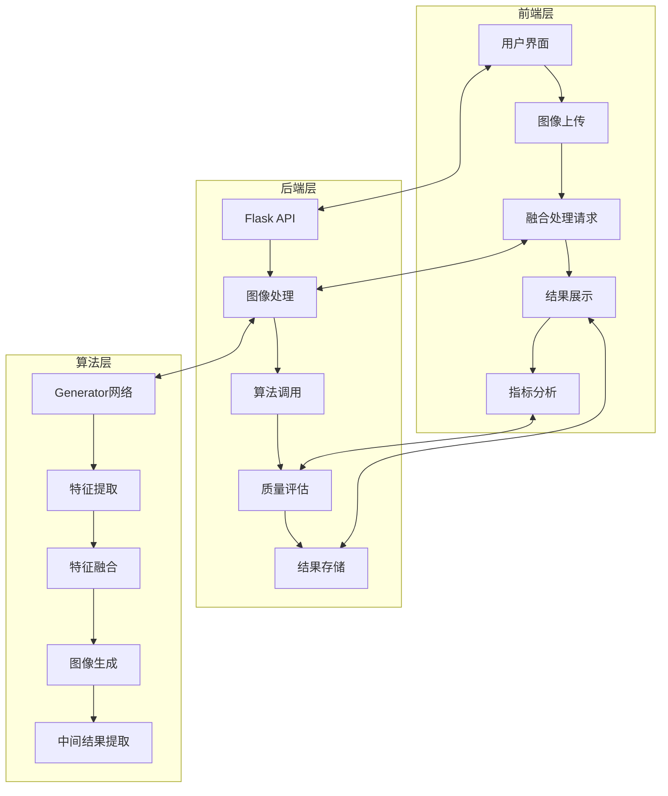

# TarDAL图像融合系统文档

## 1. 项目概述

TarDAL（Twin Adversarial Learning）是一个基于双对抗学习的红外与可见光图像融合系统，旨在通过深度学习技术实现高质量的多模态图像融合。该系统能够有效整合红外图像的热辐射信息和可见光图像的纹理细节，生成同时包含目标信息和场景细节的融合图像。

**核心功能**：

- 红外与可见光图像融合
- 多阶段融合结果展示
- 融合质量指标计算
- 检测性能提升估算
- 直观的Web用户界面

## 2. 系统架构

TarDAL采用前后端分离的架构设计，确保系统的可扩展性和维护性。



**技术架构**：

- **前端**：Vue 3 + Vite + CSS3
- **后端**：Flask + PyTorch + NumPy
- **算法**：深度学习（双对抗学习）
- **存储**：本地文件系统
- **通信**：HTTP API

## 3. 前端界面与功能

### 3.1 界面设计

TarDAL前端采用现代化的响应式设计，以深蓝色科技感主题为主，提供直观友好的用户体验。界面布局分为以下几个主要区域：

**1. 系统标题区**

- 系统名称：TarDAL图像融合系统
- 系统描述：基于双对抗学习的红外与可见光图像融合算法

**2. 图像上传区**

- 左右两侧分别为红外图像和可见光图像上传区域
- 支持点击上传和拖拽上传两种方式
- 上传后显示图像预览
- 实时反馈上传状态

**3. 控制区**

- 开始融合按钮：触发融合处理流程
- 清空重置按钮：清除所有上传和结果
- 状态信息显示：实时显示系统状态

**4. 进度显示区**

- 融合处理时显示动态进度条
- 提供视觉反馈，增强用户体验

**5. 结果展示区**

- 三阶段结果展示：
  - 第一阶段：输入图像（红外和可见光图像并排显示）
  - 第二阶段：初步融合结果（算法中间结果）
  - 第三阶段：最终融合结果
- 每个阶段配有标题和结果图像
- 最终结果提供下载功能

**6. 指标分析区**

- 基础质量指标：
  - PSNR (dB)：峰值信噪比
  - SSIM：结构相似性指数
  - 检测提升：目标检测性能提升百分比
  - 处理时间：融合处理耗时
- 高级质量指标：
  - 熵保持：信息熵保持程度
  - 梯度保持：边缘信息保持程度
  - 对比度增强：对比度提升程度

### 3.2 核心功能

**1. 图像上传功能**

- 支持多种图像格式（PNG、JPG、JPEG、BMP）
- 单个文件大小限制：15MB
- 实时图像预览
- 拖拽上传支持

**2. 融合处理功能**

- 后台异步处理
- 实时进度展示
- 错误处理与提示
- 多阶段结果生成

**3. 结果管理功能**

- 结果图像预览
- 融合结果下载
- 多阶段结果对比
- 历史结果管理

**4. 质量评估功能**

- 实时质量指标计算
- 多维度指标分析
- 视觉化指标展示
- 性能提升估算

## 4. 后端API与处理流程

### 4.1 API接口

TarDAL后端提供以下核心API接口：

| 接口路径                        | 方法     | 功能描述 | 请求参数                                    | 响应结果                      |
| --------------------------- | ------ | ---- | --------------------------------------- | ------------------------- |
| `/api/health`               | GET    | 健康检查 | 无                                       | 系统状态、模型加载状态               |
| `/api/upload`               | POST   | 上传图像 | `ir_image`：红外图像文件<br>`vi_image`：可见光图像文件 | `session_id`：会话ID<br>上传状态 |
| `/api/process`              | POST   | 处理融合 | `session_id`：会话ID                       | 融合结果、质量指标                 |
| `/api/result/<filename>`    | GET    | 获取结果 | `filename`：结果文件名                        | 结果图像文件                    |
| `/api/cleanup/<session_id>` | DELETE | 清理会话 | `session_id`：会话ID                       | 清理状态                      |

### 4.2 处理流程

**1. 图像上传流程**

1. 接收前端上传的红外和可见光图像
2. 生成唯一的会话ID
3. 保存上传的图像文件
4. 返回会话ID给前端

**2. 融合处理流程**

1. 接收前端的处理请求（包含会话ID）
2. 加载上传的图像文件
3. 调用TarDAL算法进行融合处理
4. 生成多阶段融合结果
5. 计算质量评估指标
6. 保存融合结果和阶段图像
7. 返回融合结果和质量指标

**3. 结果获取流程**

1. 接收前端的结果获取请求
2. 验证结果文件是否存在
3. 返回结果图像文件
4. 添加CORS头，支持跨域访问

### 4.3 质量评估指标

后端实现了多种质量评估指标，用于客观评价融合效果：

**基础指标**：

- **PSNR (Peak Signal-to-Noise Ratio)**：峰值信噪比，衡量融合图像与输入图像的相似性
- **SSIM (Structural Similarity Index)**：结构相似性指数，评估融合图像的结构保持能力
- **检测提升**：基于图像质量的目标检测性能提升估算
- **处理时间**：融合处理的耗时，衡量系统效率

**高级指标**：

- **熵保持**：评估融合图像的信息含量保持程度
- **梯度保持**：衡量融合图像的边缘信息保持能力
- **对比度增强**：评估融合图像的对比度提升效果

## 5. 核心算法

### 5.1 Generator网络

Generator网络是TarDAL的核心组件，负责将红外和可见光图像融合为高质量的输出图像。

**网络结构**：

- **编码器**：接收拼接的红外和可见光图像，提取初始特征
- **密集连接块**：通过多次特征提取和融合，增强特征表达能力
- **融合模块**：将提取的特征进行融合，生成最终的融合图像
- **中间结果提取**：从融合模块的中间层提取特征，生成初步融合结果

**关键参数**：

- `dim`：特征维度，默认32
- `depth`：密集连接块深度，默认3
- `return_intermediate`：是否返回中间结果，用于多阶段展示

**前向传播流程**：

1. 拼接红外和可见光图像
2. 通过编码器提取初始特征
3. 经过密集连接块进行特征增强
4. 通过融合模块生成最终融合图像
5. 提取并返回中间融合结果（如果需要）

### 5.2 双对抗学习策略

TarDAL采用双对抗学习策略，通过两个判别器分别评估融合图像的热辐射信息和纹理细节：

- **热辐射判别器**：评估融合图像是否保留了红外图像的热辐射信息
- **纹理细节判别器**：评估融合图像是否保留了可见光图像的纹理细节

这种策略确保融合图像能够同时兼顾目标信息和场景细节，提高融合质量。

### 5.3 多阶段融合

TarDAL实现了多阶段融合结果展示，让用户能够直观了解融合过程：

- **第一阶段**：输入图像，展示原始的红外和可见光图像
- **第二阶段**：初步融合结果，展示算法的中间处理结果
- **第三阶段**：最终融合结果，展示算法的最终输出

通过这种多阶段展示，用户可以更清楚地理解融合算法的工作原理和效果。

## 6. 功能特性

### 6.1 技术创新

**1. 双对抗学习**

- 采用两个判别器分别评估融合图像的不同特性
- 确保融合结果同时保留红外图像的目标信息和可见光图像的纹理细节

**2. 多阶段融合结果**

- 提供算法中间处理结果，增强系统的可解释性
- 帮助用户理解融合过程和算法工作原理

**3. 质量评估体系**

- 实现多种融合质量评估指标
- 提供客观的融合效果评价
- 估算目标检测性能提升

**4. 响应式设计**

- 适配不同屏幕尺寸的设备
- 提供一致的用户体验
- 支持移动端访问

### 6.2 实用特性

**1. 直观的用户界面**

- 现代化的Web界面设计
- 实时的操作反馈
- 清晰的结果展示

**2. 高效的处理流程**

- 异步处理，避免界面阻塞
- 优化的算法实现
- 合理的资源利用

**3. 完整的错误处理**

- 详细的错误信息提示
- 健壮的异常处理机制
- 友好的用户反馈

**4. 便捷的结果管理**

- 融合结果自动保存
- 支持结果图像下载
- 多阶段结果对比

## 7. 技术栈

### 7.1 前端技术

| 技术                | 版本  | 用途   |
| ----------------- | --- | ---- |
| Vue 3             | 3.x | 前端框架 |
| Vite              | 4.x | 构建工具 |
| CSS3              | -   | 样式设计 |
| Font Awesome      | 6.x | 图标库  |
| JavaScript (ES6+) | -   | 前端逻辑 |

### 7.2 后端技术

| 技术      | 版本    | 用途     |
| ------- | ----- | ------ |
| Python  | 3.8+  | 后端开发   |
| Flask   | 2.x   | API框架  |
| PyTorch | 1.10+ | 深度学习框架 |
| NumPy   | 1.20+ | 数值计算   |
| OpenCV  | 4.x   | 图像处理   |
| Kornia  | 0.6+  | 计算机视觉库 |
| PIL     | 9.x   | 图像处理   |

### 7.3 算法技术

| 技术     | 用途      | 实现方式         |
| ------ | ------- | ------------ |
| 深度学习   | 特征提取与融合 | PyTorch实现    |
| 对抗学习   | 质量评估与优化 | 双判别器架构       |
| 密集连接   | 特征增强    | DenseNet风格设计 |
| 中间结果提取 | 多阶段展示   | 特征图平均值       |

## 8. 使用指南

### 8.1 系统启动

**1. 后端启动**

```bash
# 进入后端目录
cd backend

# 安装依赖
pip install -r requirements.txt

# 启动服务
python start_server.py
```

**2. 前端启动**

```bash
# 进入前端目录
cd frontend

# 安装依赖
npm install

# 启动开发服务器
npm run dev
```

### 8.2 使用流程

**1. 图像上传**

- 点击或拖拽红外图像到左侧上传区域
- 点击或拖拽可见光图像到右侧上传区域
- 系统会自动预览上传的图像

**2. 融合处理**

- 点击"开始融合"按钮
- 系统会显示处理进度
- 等待处理完成（通常需要几秒钟）

**3. 结果查看**

- 查看三个阶段的融合结果
- 分析融合质量指标
- 点击"下载结果"按钮保存融合图像

**4. 重置操作**

- 点击"清空重置"按钮
- 系统会清除所有上传和结果
- 可以开始新的融合任务

### 8.3 注意事项

- 确保后端服务已启动并正常运行
- 上传的图像文件大小不要超过15MB
- 建议使用分辨率相近的红外和可见光图像
- 融合处理可能需要一定时间，请耐心等待
- 如果遇到错误，请检查系统日志获取详细信息

## 9. 功能演示

### 9.1 界面截图

#### 主界面


#### 融合结果展示

 


### 9.2 处理流程演示

**1. 上传图像**

- 显示上传区域和提示信息
- 支持拖拽上传功能
- 实时预览上传的图像

**2. 融合处理**

- 显示动态进度条
- 提供实时处理状态
- 处理完成后显示结果

**3. 结果分析**

- 展示三个阶段的融合结果
- 显示详细的质量评估指标
- 提供结果下载功能

## 10. 总结与展望

### 10.1 系统优势

TarDAL图像融合系统具有以下显著优势：

- **高质量融合**：基于深度学习的双对抗学习策略，生成高质量的融合图像
- **直观界面**：现代化的Web用户界面，提供良好的用户体验
- **多阶段展示**：实现多阶段融合结果展示，增强系统的可解释性
- **全面评估**：提供多种质量评估指标，客观评价融合效果
- **易于使用**：简化的操作流程，降低用户使用门槛

### 10.2 应用场景

TarDAL系统在以下场景中具有广阔的应用前景：

- **安防监控**：夜间或低光照条件下的目标检测与识别
- **军事侦察**：战场环境中的目标探测与态势感知
- **自动驾驶**：复杂环境下的障碍物检测与路径规划
- **医疗成像**：多模态医学图像的融合与分析
- **遥感应用**：多光谱遥感图像的信息融合与处理

### 10.3 未来展望

未来，TarDAL系统可以从以下几个方面进行改进和扩展：

- **模型优化**：进一步优化网络结构，提高融合质量和处理速度
- **多模态扩展**：支持更多模态的图像融合，如红外、可见光、雷达等
- **实时处理**：优化算法，实现实时的图像融合处理
- **智能分析**：集成目标检测和识别功能，提供更全面的分析能力
- **云服务化**：部署为云服务，提供API接口供其他系统调用
- **移动端适配**：开发移动应用，支持移动端的图像融合需求

### 10.4 结论

TarDAL图像融合系统是一个功能完整、性能优秀的多模态图像融合解决方案。通过深度学习技术和现代化的系统设计，它能够有效整合不同模态图像的优势，生成高质量的融合结果。系统的直观界面和全面的功能使其成为研究和应用图像融合技术的理想工具。

随着技术的不断发展和应用场景的扩展，TarDAL有望在更多领域发挥重要作用，为多模态信息融合技术的发展做出贡献。